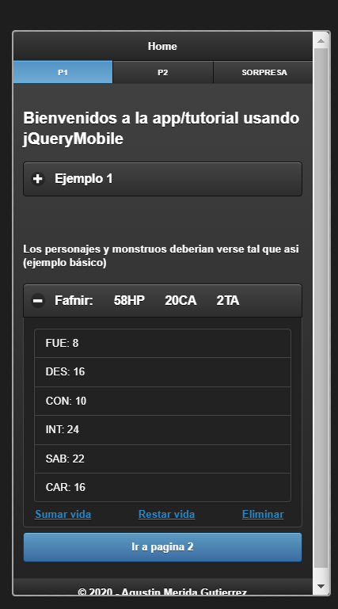

# Curso-jQuery-Mobile

En este repositorio se almacenarán todos los archivos de un curso sencillo de jQuery Mobile un framework que nos permite diseñar aplicaciones multiplataforma ahorrando tiempo ya que el código es valido tanto para navegador web como para dispositivos móviles. Este framework se va a utilizar para realizar la aplicación Kombat Simulator, la cual se encuentra en el siguiente repositorio: 

-----------------------------

KOMBAT SIMULATOR: https://github.com/Agumeri/Kombat-Simulator-jQueryMobile

-----------------------------

## A continuación, se mostrará una pequeña guía sobre todos los recursos que se han utilizado del framework jQuery Mobile:

### data-role

  Como bien sabemos, una web se esctrutura con header, section, aside y footer. Pues para realizar esto en nuestra aplicación, jQuery Mobile nos permite asignarle un tipo de atributo a un div por ejemplo. Los utilizados para la estructura son los siguientes: 
* data-role="header"
* data-role="content"/data-role="main"
* data-role="footer"

Ademas, haciendo uso de data-role podemos asignar botones, cajas, cuadros de dialogo, etc, cada uno con sus propias características a modificar. Se describirán ahora los utilizados en este tutorial, pero para saber más solo hay que acceder a la documentación oficial de jQuery Mobile, clicando [aquí](https://demos.jquerymobile.com/1.1.2/docs/api/data-attributes.html)

#### *data-role="navbar"*
  Con este atributo podremos asignar una barra de navegación para nuestra aplicación. Un ejemplo del código sería el siguiente: 
  ```html
    <div data-role="navbar">
         <ul>
             <li><a href="index.html"class="ui-btn-active">P1</a></li>
             <li><a href="pagina2.html">P2</a></li>
             <li><a href="https://www.youtube.com/watch?v=35XFAkwmU4c">SORPRESA</a></li>
         </ul>
    </div>
  ```
  
  
  #####
   Tras todo lo realizado, el codigo subido a este repositorio quedaría tal que así visto desde un dispositivo movil: 
   
   
    
